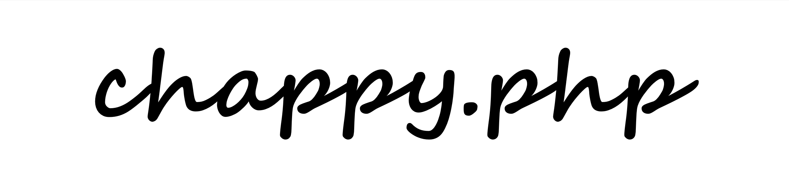

<div style="text-align: center;">
  
</div>


[Visit our Wiki](https://chapmancbvcu.github.io/chappy-php-starter/) <br>
[Chappy.php API](https://chapmancbvcu.github.io/chappy-php-framework/)

# Chappy.php Framework

> A lightweight, modern, and extensible PHP MVC framework for building robust web applications with ease.

---

## 📦 Overview

Chappy.php is a modern PHP MVC framework focused on clarity, modularity, and rapid development. It powers the [chappy-php/chappy-php](https://github.com/chappy-php/chappy-php) starter project and includes features inspired by Laravel, Symfony, CodeIgniter, and custom lightweight design.

---

🧰 Features
- ⚛️ Native React.js View Support
- 💡 Lightweight, fast PHP MVC core
- 🧭 Dynamic routing with controllers
- 🧱 Layouts, components, and templating
- 🔐 Built‑in user authentication & ACL
- ✍️ Custom form handling and validation
- 📥 Secure file uploads
- 🔔 Email service with customizable templates
- 📡 Event/Listener system for decoupled logic
- 🧵 Job dispatching and background queue support
- 🧪 Unit testing with PHPUnit, Vitest, and test API helpers
- 🔥 Vite‑based asset bundling
- 🎛 Symfony Console–powered CLI (console)
- 🌱 Seeders, migrations, and database helpers
- 📊 Doctum‑generated API documentation
- 📖 Built‑in Jekyll user guide
- 🧾 .env configuration via vlucas/phpdotenv
- 📂 Organized PSR‑4 project structure
- 📚 [Jekyll user guide](https://chapmancbvcu.github.io/chappy-php-starter/)

---

## System Requirements
- Apache or Nginx (or XAMPP)
- PHP 8.4
- MySQL or MariaDB
- Composer, Node.js, npm
- SQL Management software
- Composer
- git
- OS: macOS / Linux / Windows 11+

---

## 🚀 Getting Started

Chappy.php is published as a Composer package.

Install via [chappy-php/chappy-php](https://github.com/chappy-php/chappy-php) starter project:

```bash
composer create-project chappy-php/chappy-php my-app
```

---

📄 Documentation
Full documentation is included with the project. After setup, access:
- 📘 User Guide
- 🔧 API Reference

---

📬 Contact
Questions or suggestions? 📧 chad.chapman2010@gmail.com.
🐛 [Open an issue](https://github.com/chapmancbVCU/chappy-php-framework/issues)

---

🌐 Social
Youtube: https://www.youtube.com/@chappy-php

---

🏆 Credits
1. “mvc” icon by iconixar, from thenounproject.com.
2. Freeskills on YouTube (https://www.youtube.com/playlist?list=PLFPkAJFH7I0keB1qpWk5qVVUYdNLTEUs3)

---

**Release Notes**

[v2.0.0](https://chapmancbvcu.github.io/chappy-php-starter/jekyll/update/2026/01/25/Version-2-ReleaseNotes.html)